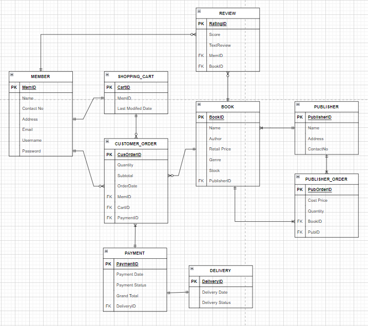

# E-BookStore-Database-System

This is an e-bookstore database system created with SQL using MSSQL.
> Group Member : <a href="https://github.com/YFShADoW">Yao Feng</a>,  <a href="https://github.com/Jingwen0515">Jing Wen</a>

## Introduction to Database Management

- Worked as part of a team to build a relational database for an  
- E-bookstore using MSSQLServer. 
- Applied Business Rules, Normalisation up to 3rd Normal Form
- Applied Data Definition Language and Data Manipulation Language
- Responsible for establishing relationships between entities in an ERD

---

## Scenario

A Bookstore located in Kuala Lumpur Malaysia has vast collection of books in its warehouse. The bookstore ordered books of various genres from different publishers and sell them to the customers. As their business grows, the bookstore would like to implement an online store to facilitate the purchase of books to more customers. Your team is assigned the project to design and implement a database system for online E-Bookstore Database System. 

- Publishers frequently send lists of latest books to the e-bookstore manager. The bookstore manager compiles a list of needed books and sends an order to the publishers. The publisher supplies the ordered books to the bookstore. The bookstore manager records the details of the order and books that have arrived at the bookstore. The orders sent to publishers need to be recorded in the database 
- Customers, who wish to purchase books online, need to initially register as members. Members will be able to view the book, read reviews and provide review for the books.
- Members who wish to purchase can select their books into the shopping cart. The cart will show the summary of the selection and total cost to be paid. Once the payment is made, the order is confirmed, the bookstore will send the books to the customers within 7 working days.
- The system should manage information about books in the bookstore, members and books they have ordered as well as payment details and delivery status.
- Members can also provide 'rating' for a book, as a score (1-10 which is 1= terrible, 10= masterpiece) along with optional short text review. No changes are allowed and only one review/rating per user per book is allowed.

## Data Manipulation Language (DML)

1. Find the total number of books published by each publisher. Show publisher id, publisher name, and number of books published.
2. Show the books in the shopping cart for each member which have not been check-out
3. List the book(s) which has the highest average rating. Show book id, book name, and the rating.
4. Find the total number of feedbacks per member. Show member id, member name, and total number of feedbacks per member.
5. Find the publisher who published the most number of books
6. Find the total number of books ordered by store manager from each publisher.
7. Find the genres of the book which has the most number of book quantity in stock
8. Find the bestselling book(s).
9. Show the member(s) who spent most on buying books.
10. Show the member(s) who had not make any order
11. A list of purchased books that have not been delivered to members. 
12. Show the members who made more than 2 orders.

---

## Business Rule

<ins>**CUSTOMER**</ins>
- Every CUSTOMER of the e-bookstore will register as a MEMBER using their email account and password. 

<ins>**MEMBER**</ins>
- Each MEMBER can have zero, one, or many CUSTOMER ORDER, each CUSTOMER ORDER is made by only one MEMBER.
- MEMBER can buy different BOOKS at the same time but will be assigned with different CUSTOMER ORDER.
- Each MEMBER can be associated with only one SHOPPING CART.
- One MEMBER can select many BOOKS into their SHOPPING CART, but one BOOK can be added to many SHOPPING CARTS. This is a many-to-many relationship.
- A MEMBER can only give one rating to a BOOK, but a book can receive different REVIEW from different MEMBER, as a score (1-10 which is 1= terrible, 10= masterpiece) along with the short text review.

<ins>**PUBLISHER**</ins>
- One PUBLISHER  can provide many different BOOKS to one bookstore, but these BOOKS can only be supplied by one PUBLISHER. This is a one-to many-relationship.
- A PUBLISHER can receive one or many PUBLISHER ORDER from the bookstore, but the PUBLISHER ORDER is made by one bookstore.

<ins>**ORDER**</ins>
- The information of MEMBER and BOOKS will be included in the CUSTOMER ORDER.
- BOOKS in bookstores may or may not be ordered by MEMBERS.
- One CUSTOMER ORDER can purchase many of the same BOOKS from the bookstore.
- Each MEMBER will need one or many books to drop a CUSTOMER ORDER and continue to make a PAYMENT.
- One PUBLISHER ORDER can purchase many of the same BOOKS from the PUBLISHER
- The E-bookstore will buy BOOKS from the PUBLISHER at cost price and sell to MEMBER at retail price.

<ins>**SHOPPING CART**</ins>
- The Last Modified Date of the SHOPPING CART will be recorded in the system and it will keep updated.

<ins>**DELIVERY**</ins>
- The DELIVERY status can only be viewed after PAYMENT is done and it will be delivered upon 7 days.
- The DELIVERY status can only be "in progress" or "delivered". After the CUSTOMER ORDER is delivered, the delivery date will be recorded in the system.

<ins>**PAYMENT**</ins>
- A PAYMENT must be associated with only one or many CUSTOMER ORDER at the same time.
- Payment Status can only be "SUCCESSFUL" or "UNSUCCESSFUL".
- The sum of subtotal from the CUSTOMER ORDER which is ordered by the MEMBERS at the same time will be displayed as a Grand total in the PAYMENT details.

---

## Entity Relationship Diagram

